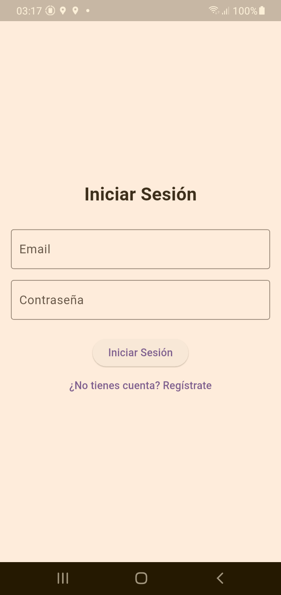
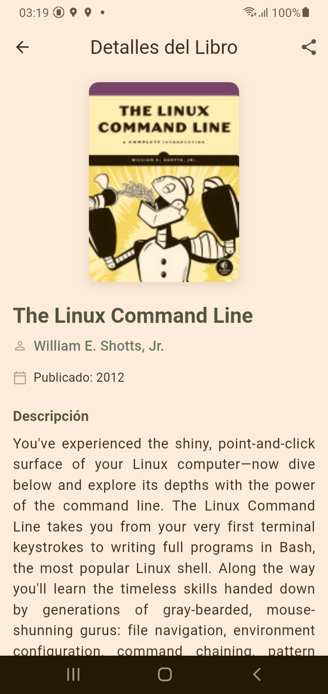
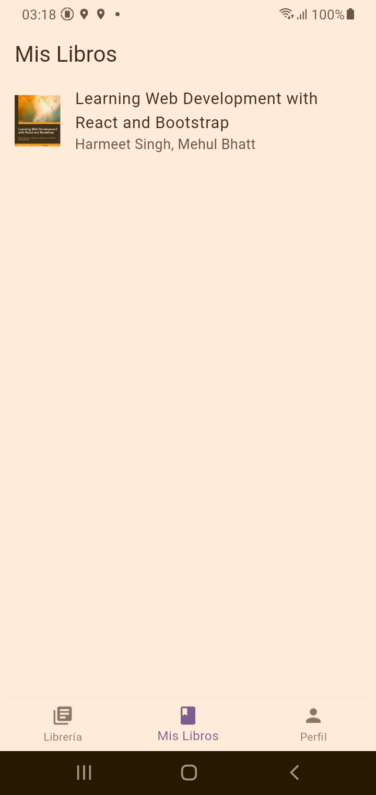
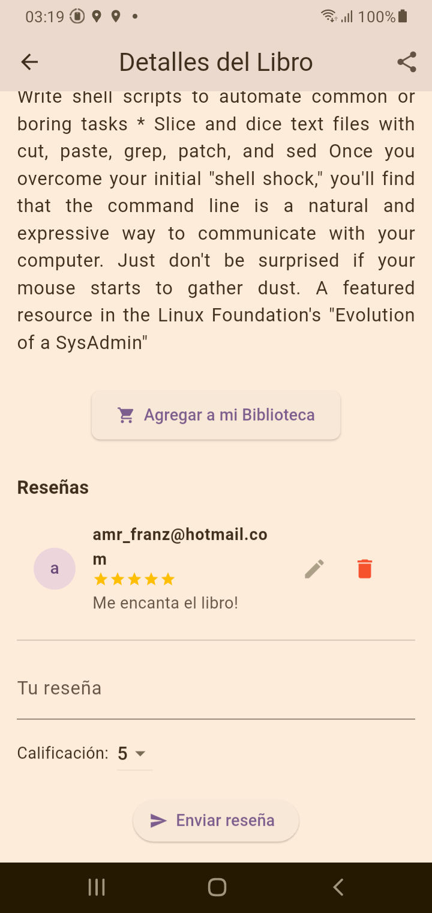

# 📚 Book Review App

Una aplicación móvil construida con **Flutter**, que permite buscar libros desde la API de Udacity, ver detalles, agregar reseñas con Firebase y gestionar una biblioteca personal. Se utiliza **Firebase Authentication**, **Cloud Firestore**, **Flutter BLoC**, y variables de entorno con **flutter_dotenv**.

---

## 🚀 Características

- Autenticación con Firebase
- Búsqueda de libros (API externa)
- Visualización de detalles del libro
- Gestión de reseñas por usuario autenticado
- Agregar libros a "Mi Biblioteca"
- Manejo de estado con BLoC
- Variables de entorno con `.env`

---

## 📁 Estructura del Proyecto

```
book_review/
├── lib/
│   ├── blocs/
│   │   ├── auth/
│   │   ├── auth_status/
│   │   ├── books/
│   │   ├── library/
│   │   ├── my_books/
│   │   └── review/
│   │   ├── search/
│   ├── models/
│   ├── repositories/
│   ├── screens/
│   │   ├── auth/
│   │   ├── main/
│   ├── utils/
│   ├── widgets/
│   └── main.dart
├── assets/
├── .env
├── pubspec.yaml
└── README.md
```

---

## ⚙️ Configuración Inicial

### 1. Clonar el repositorio

```bash
git clone https://github.com/fauni/mynewbookreview.git
cd mynewbookreview
```

### 2. Instalar dependencias

```bash
flutter pub get
```

### 3. Crear archivo `.env`

En la raíz del proyecto, crea un archivo `.env`:

```env
API_BASE_URL=https://reactnd-books-api.udacity.com
```

### 4. Configurar Firebase tomar en cuenta que solo si quiere cambiar de cuenta debemos realizar este paso de otro modo la aplicación puede funcionar si seguir los pasos del punto 4.

1. Accede a [Firebase Console](https://console.firebase.google.com/)
2. Crea un nuevo proyecto y habilita:
   - Firebase Authentication (con Email/Password)
   - Cloud Firestore
3. Descarga `google-services.json` y colócalo en:

```
android/app/google-services.json
```

4. Agrega estas líneas en `android/build.gradle`:

```gradle
classpath 'com.google.gms:google-services:4.3.10'
```

Y en `android/app/build.gradle`:

```gradle
apply plugin: 'com.google.gms.google-services'
```

---

## 🧪 Ejecutar la app

```bash
flutter run
```

---

## 📦 Paquetes importantes utilizados

- [`flutter_bloc`](https://pub.dev/packages/flutter_bloc)
- [`firebase_auth`](https://pub.dev/packages/firebase_auth)
- [`cloud_firestore`](https://pub.dev/packages/cloud_firestore)
- [`flutter_dotenv`](https://pub.dev/packages/flutter_dotenv)
- [`equatable`](https://pub.dev/packages/equatable)

---

## ✅ Estado del desarrollo

- [x] Login / Registro
- [x] Buscar libros
- [x] Ver detalles del libro
- [x] Agregar reseña
- [x] Editar / eliminar reseña propia
- [x] Agregar a Mi Biblioteca
- [x] Manejo de estado con BLoC

---

## ✨ Créditos

Esta aplicación fue desarrollada como parte de un proyecto educativo. La API de libros es proporcionada por Udacity:

🔗 [https://reactnd-books-api.udacity.com](https://reactnd-books-api.udacity.com)

---

## 📸 Capturas de Pantalla





